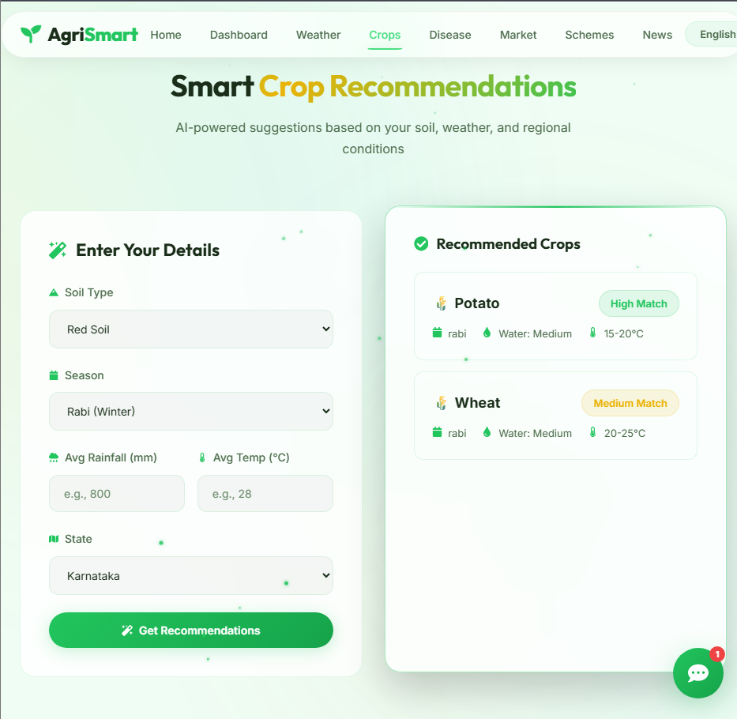

<div align="center">
  <h1>🌱 Intelligent Farming Assistant</h1>
  <p><strong>Personalized Crop Planning using AI</strong></p>
  
  [](https://reactjs.org/)
  [](https://vitejs.dev/)
  [](https://opensource.org/licenses/MIT)
</div>

<br />

Welcome to the Intelligent Farming Assistant project! This application provides personalized crop planning, weather insights, market prices, and disease detection using AI to help farmers make data-driven decisions.

## 📋 Table of Contents
- [Features](#-features)
- [Screenshots](#-screenshots)
- [Project Structure](#-project-structure)
- [Getting Started](#-getting-started)
- [Technologies Used](#-technologies-used)
- [Contributing](#-contributing)
- [License](#-license)

---

## ✨ Features
- **Crop Recommendation**: Get personalized crop suggestions based on environmental conditions.
- **Disease Detection**: Upload images of plant leaves to identify diseases and get remedies.
- **Weather Insights**: View current weather and forecasts for your location.
- **Market Prices**: Check the latest market prices for various crops.
- **Crop Calendar & Growth Assistant**: Plan your farming activities with a personalized calendar.
- **Water Management**: Get irrigation recommendations.
- **Schemes & News**: Stay updated with the latest government schemes and agricultural news.

## 📸 Screenshots

| Dashboard | Crop Recommendation |
|:---:|:---:|
|  |  |
| **Disease Detection** | **Weather Insights** |
|  |  |

## 📂 Project Structure

The project has been structured for scalability and maintainability:

```text
src/
├── assets/          # Static assets like images and icons
├── components/      # Reusable UI components
│   ├── layout/      # Layout components like Navbar and Footer
│   └── ui/          # Generic UI components like Chatbot and Fireflies
├── config/          # Configurations (e.g. i18n)
├── pages/           # Page-level components grouped by feature
│   ├── auth/        # Authentication pages (Login, Register)
│   ├── dashboard/   # Dashboard page
│   ├── farming/     # Farming-related pages (Crop Calendar, Growth Assistant, Recommendation, Disease Detection, Water Management)
│   ├── info/        # Informational pages (News Feed, Schemes, Weather)
│   ├── market/      # Market prices
│   └── Landing.jsx  # Landing page
├── locales/         # Internationalization (i18n) files
├── styles/          # Global styles (App.css, index.css)
├── App.jsx          # Main application component and routing
└── main.jsx         # Application entry point
```

## 🚀 Getting Started

### Prerequisites
- Node.js (v16 or higher recommended)
- npm or yarn

### Installation
1. Install dependencies:
   ```bash
   npm install
   ```

### Running the Application
To start the development server, run:
```bash
npm run dev
```
The application will be available at `http://localhost:5173/`.

## 🛠 Technologies Used
- **Frontend Framework**: React.js
- **Build Tool**: Vite
- **Routing**: React Router
- **Styling**: Tailwind CSS / Custom CSS with CSS Variables
- **Internationalization**: i18next

## 🤝 Contributing
Contributions are what make the open-source community such an amazing place to learn, inspire, and create. Any contributions you make are **greatly appreciated**.

1. Fork the Project
2. Create your Feature Branch (`git checkout -b feature/AmazingFeature`)
3. Commit your Changes (`git commit -m 'Add some AmazingFeature'`)
4. Push to the Branch (`git push origin feature/AmazingFeature`)
5. Open a Pull Request

## 📄 License
Distributed under the MIT License. See `LICENSE` for more information.
